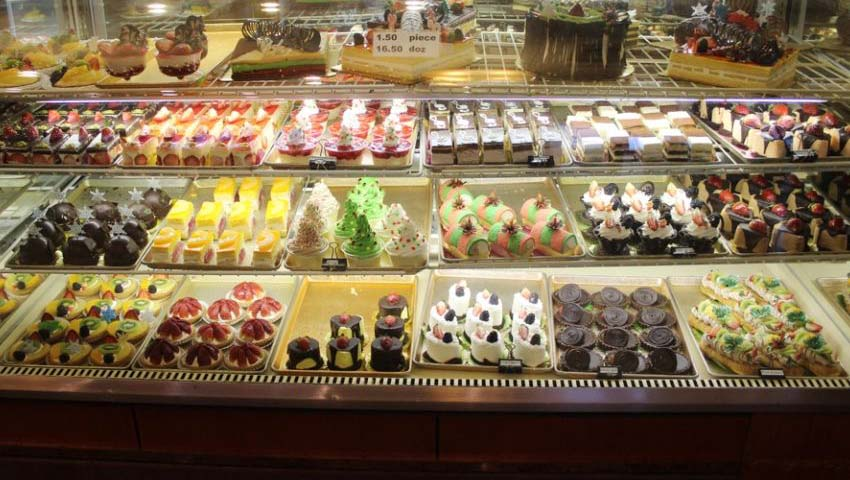

# Padaria Plus 🥐

This is one of my first projects using **HTML** and **CSS**, created during a course at [DevMedia](https://www.devmedia.com.br/).  
It uses basic tags and styling to build a small bakery-themed website.

Feel free to explore the code and suggest improvements — I'm currently learning and looking forward to developing my skills further! 🚀

## Features
- Simple responsive layout
- Basic HTML structure
- Custom CSS styling
- Clean and readable code

## Preview

## Technologies
- HTML5
- CSS3

---

Thank you for visiting this repository! 😊
